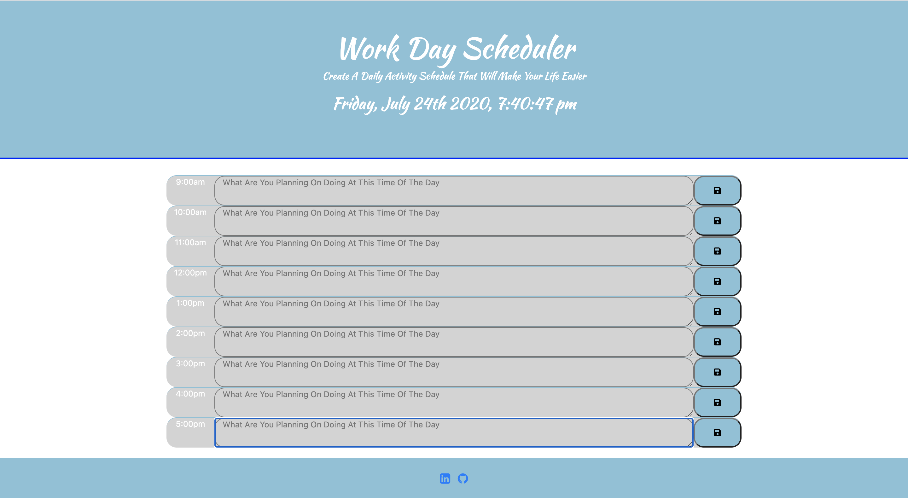

# Day Planner

<h2>Purpose</h2>

<h2><a href='https://kamara-moses.github.io/Day-Planner/'>Scheduler</a></h2>

This application was created for individual with busy schedules. Users can utilize the application by writing what they are doing in the different time blocks. After writing the activity in the timeblock, the user can click the save button to save the activity. The user will be able to access the application using the web browser and see what activity they have saved for that given time block.

<h2>Technologies Used</h2>

Moment.js - was utilized to be able to set the currentDate and Time up on the jumbotron heading
BootStrap - was utilized for styling of the heading(jumbotron), the container that houses the hours, activities and save button.
Font Awesome - was utilized to give the save button an icon of a disk that symbolizes save function

<h2>Difficulties Encountered</h2>

During the application build, I encountered some problems with color coordinating between past, present and future time blocks. I spent most of my time trying to figure out how to get the colors to match the scope of past, present and future. After doing some research, I was able to achieve the color matching I wanted. Overall, the application build was a learning experience for me and It was exciting when things started to work as they needed to.

<h2>Modification and Improvements</h2>

I would like to expand the time blocks and create more of a monthly daily activity calender. I believe that with busy schedule utilize an application that lets you track activities will be beneficial for users. 

    - This application is open for improvements.